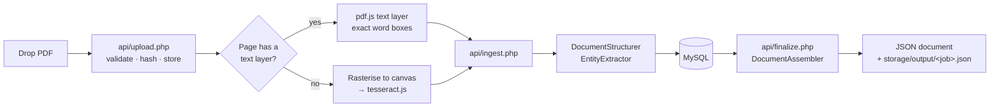

# pdfOCR

### Created by:
**Manuel Jesús Torres Pérez**
<https://www.linkedin.com/in/manuel-jesus-torres-perez/>
`My LinkedIn`
<https://ingeniarte.es>
`Ingeniarte.es`

**Drop a PDF, get structured JSON.** Not a wall of text — pages, blocks, lines,
tables, label/value pairs and typed entities, each with its position on the page.


Most "PDF to text" tools hand back a string and leave the hard part to you.
pdfOCR keeps the geometry: it groups words into lines, lines into typed blocks,
detects tables and `Label: value` pairs, and normalises what it finds — dates
become ISO dates, `1.250,00 EUR` becomes `1250.0`, and Spanish NIF/NIE and IBAN
values are checksum-verified.

```jsonc
"key_values": [
  { "key": "fecha", "label": "Fecha", "value": "12/03/2025", "occurrences": [ … ] }
],
"entities": {
  "date":   [ { "page": 1, "raw": "12/03/2025",   "value": "2025-03-12" } ],
  "amount": [ { "page": 1, "raw": "1.250,00 EUR", "value": 1250 } ],
  "iban":   [ { "page": 1, "raw": "ES9121000418450200051332", "value": "ES9121000418450200051332" } ]
}
```

---

## Features

- **Dropzone intake** — drag and drop, click, keyboard or paste. Validated on
  both sides (size, extension, MIME, `%PDF-` magic bytes).
- **Two reading paths, chosen per page.** A PDF with an embedded text layer is
  read directly — exact and instant. A scanned page is rasterised at ~220 dpi
  and passed to OCR. A mixed document uses both and says so.
- **Structure, not just text.** Words → lines → blocks typed as `heading`,
  `paragraph`, `list`, `key_value` or `table`, each with a bounding box in PDF
  points and a relative box for drawing.
- **Table detection** — columns found by clustering wide gaps, snapped to median
  anchors, header row separated from the body.
- **Typed entities** — dates, amounts with currency, percentages, email, URL,
  phone, NIF, NIE, CIF, IBAN. Normalised, and validated where a checksum exists.
- **Page map** — a schematic of every page showing the blocks that were found,
  so you can see the parse rather than trust it.
- **Everything stored** in MySQL through PDO: jobs, pages, blocks and entities.
  Reopen any previous run, or query across all of them.
- **Local by default.** The PDF never leaves the machine; recognition runs in
  your browser, structuring runs in your PHP.
- **No build step, no framework, no Composer.** Vanilla ES modules and vanilla
  CSS, two CDN libraries.

## How it works



The split is deliberate: **the browser recognises, PHP structures.** Recognition
needs a canvas and a WASM engine, so it belongs in the browser. Layout analysis
is pure logic, so it belongs on the server where it can be tuned, tested and
reused by a future batch importer with no browser involved.

Everything crossing the wire uses **PDF points with a top-left origin**, for both
paths, so PHP never has to know which engine produced a word.

## Requirements

- PHP 8.1 or newer with `pdo_mysql`, `mbstring`, `fileinfo`
- MySQL 8.0 (or MariaDB 10.5+)
- Apache or nginx — or just `php -S`
- A browser with WebAssembly (any current one) and internet access on first run,
  for the two CDN libraries and the OCR language data

No Composer, no npm, no Tesseract binary on the server.

## Install

```bash
git clone https://github.com/<you>/pdfOCR.git
cd pdfOCR
```

Point a vhost at the project folder — with Laragon or XAMPP, dropping it in
`www/` is enough — then open it in a browser. On the first request the app
creates the `pdfocr` database if it is missing and applies `db/schema.sql`.

If your MySQL is not `root` with an empty password:

```bash
cp config/config.local.php.example config/config.local.php
# edit the db credentials; the file is gitignored
```

Or serve it directly:

```bash
php -S localhost:8000
```

Make sure `storage/uploads` and `storage/output` are writable. Both are blocked
from the web by `storage/.htaccess`, and JSON is served through
`api/download.php`. That file is Apache-only: under nginx or `php -S`, add the
equivalent deny rule yourself, or `storage/` is browsable.

## Configuration

Everything lives in `config/config.php`; override any subset in
`config/config.local.php`.

| Key | Default | What it does |
| --- | --- | --- |
| `app.debug` | `true` | Adds the exception message to API error responses. Turn off in production. |
| `app.auto_migrate` | `true` | Applies `db/schema.sql` on request when it changed. |
| `app.schema_version` | `1.0` | Stamped into every JSON document. Bump when the shape changes. |
| `upload.max_bytes` | 25 MB | Enforced in PHP regardless of `php.ini`. |
| `upload.retain_source` | `true` | Keep the uploaded PDF next to its JSON. |
| `ocr.default_language` | `spa` | Preselected language; the browser remembers your choice. |
| `structure.text_layer_min_chars` | `120` | Below this, a page is rasterised and OCR'd instead of trusting its text layer. |
| `structure.line_tolerance` | `0.6` | Vertical distance, in median glyph heights, for two words to share a line. |
| `structure.block_gap_factor` | `1.45` | Vertical gap, in median line heights, that starts a new block. |
| `structure.kv_block_ratio` | `0.6` | Share of lines matching `Label: value` for a block to be typed `key_value`. |

## Using it

Drop a PDF. The rail on the left shows progress per page; the panel on the right
fills in when the run finishes:

- **JSON** — a collapsible, filterable tree of the whole document
- **Structure** — the page map: every block drawn from its bounding box, hover to
  read it
- **Fields** — label/value candidates, typed entities and detected tables as
  tables
- **Plain text** — the reading-order text, if that is all you need

**Copy JSON** puts the document on the clipboard; **Download .json** saves it.
Tick *Include word-level boxes* before dropping the file to get per-word boxes
and confidences — roughly triples the size.

## HTTP API

All endpoints return JSON and answer errors as `{ "ok": false, "error": "…" }`
with a real status code. Writes require the session token rendered into the page
and enforce a same-origin check.

| Endpoint | Method | Body / query | Returns |
| --- | --- | --- | --- |
| `api/upload.php` | POST | multipart: `file`, `language`, `token` | `{ ok, job: { id, file_name, size_bytes, sha256, language } }` |
| `api/ingest.php` | POST | json: `job_id`, `token`, `page`, `page_count?`, `language?` | the structured summary of that page |
| `api/finalize.php` | POST | json: `job_id`, `token`, `duration_ms?`, `include_words?`, `error?` | `{ ok, download_url, document }` |
| `api/result.php` | GET | `job`, `words=1?` | `{ ok, status, document }` |
| `api/download.php` | GET | `job`, `words=1?` | the JSON as a file attachment |
| `api/jobs.php` | GET | `limit?` | `{ ok, jobs: [ … ] }` |
| `api/jobs.php` | DELETE | `job`, `token` | deletes the job, its rows and its files |

A page posted to `api/ingest.php` looks like this — produce it however you like,
the browser is not special:

```jsonc
{
  "job_id": "3b34fc17-6ac7-489b-9cc8-85ce7e7088c9",
  "token": "…",
  "page_count": 1,
  "page": {
    "number": 1,
    "width": 595, "height": 842, "rotation": 0,
    "source": "text_layer",
    "words": [
      { "text": "Fecha:", "x0": 56, "y0": 103, "x1": 87, "y1": 113, "size": 10 },
      { "text": "12/03/2025", "x0": 90, "y0": 103, "x1": 140, "y1": 113, "size": 10 }
    ]
  }
}
```

## Output shape

`schema_version` `1.0`, abridged:

```jsonc
{
  "schema_version": "1.0",
  "generated_at": "2026-08-08T23:05:49+02:00",
  "job":      { "id", "file_name", "size_bytes", "sha256", "language", "engine", "created_at" },
  "document": { "page_count", "source", "mean_confidence", "title", "text" },
  "summary":  { "word_count", "char_count", "line_count", "block_count",
                "table_count", "key_value_count" },

  "key_values": [
    { "key": "expediente", "label": "Expediente", "value": "2025/CA-04871",
      "occurrences": [ { "page": 1, "block_id": "p1-b2", "value": "…",
                         "confidence": null, "bbox": { … } } ] }
  ],

  "tables": [
    { "page": 1, "block_id": "p1-b6", "columns": 3,
      "column_anchors": [56, 300, 420],
      "header": ["Concepto", "Valor", "Limite"],
      "rows": [ ["Resistencia de tierra", "18,40", "37,00"] ],
      "bbox": { "x0": 56, "y0": 299, "x1": 450, "y1": 357 } }
  ],

  "entities": { "date": [ { "page", "raw", "value" } ], "amount": [ … ] },

  "pages": [
    { "number": 1, "width": 595, "height": 842, "unit": "pt", "rotation": 0,
      "source": "text_layer", "confidence": null, "word_count": 82,
      "text": "…",
      "blocks": [
        { "id": "p1-b1", "page": 1, "type": "heading",
          "text": "INFORME TECNICO DE INSPECCION",
          "bbox":     { "x0": 56, "y0": 47.6, "x1": 317, "y1": 65.6 },
          "rel_bbox": { "x": 0.0941, "y": 0.0565, "w": 0.4387, "h": 0.0214 },
          "confidence": null, "line_count": 1,
          "lines": [ { "text": "…", "bbox": { … }, "confidence": null, "font_size": 18 } ] }
      ],
      "tables": [ … ], "key_values": [ … ] }
  ],

  "warnings": ["Page 2 produced no text."]
}
```

Notes:

- `source` is `text_layer`, `ocr`, `mixed` or `empty`. `confidence` is `null` on
  text-layer pages, because nothing was guessed.
- `bbox` is absolute PDF points, top-left origin. `rel_bbox` is `{x,y,w,h}` in
  0–1 of the page.
- `lines[].words` only appears when word-level output was requested.

## Database

Five tables, all created for you. Full column-by-column documentation, the ERD
and worked queries are in **[docs/DATABASE.md](docs/DATABASE.md)**.

| Table | Holds |
| --- | --- |
| `ocr_jobs` | One row per uploaded PDF: status, hash, page count, confidence, timings |
| `ocr_pages` | One row per page: dimensions, source, text, and the full layout as JSON |
| `ocr_blocks` | One row per block, so you can query by block type across documents |
| `ocr_entities` | Key/value candidates and typed entities, with page and box |
| `ocr_field_labels` | Empty by design — the target for the field-mapping milestone |

## Project layout

```
index.php                 page shell
api/                      upload · ingest · finalize · result · download · jobs
src/                      Database · Migrator · Http · Uploader · JobRepository
                          DocumentStructurer · EntityExtractor · DocumentAssembler
assets/css/app.css        all styling
assets/js/                app · api · pdf-processor · ocr · dropzone
                          json-viewer · views
config/                   config.php (+ your config.local.php)
db/schema.sql             the schema, written to be re-runnable
docs/DATABASE.md          database documentation
storage/                  uploads/ and output/, blocked from the web
legacy/                   the original single-file version this replaced
```

`CLAUDE.md` documents the conventions and the reasoning behind the split, for
anyone — human or agent — picking the code up.

## Limitations

- Rotated and vertical text is not handled; the text-layer path assumes an
  upright baseline.
- Multi-column pages are read top to bottom, so columns interleave. Column
  detection is not implemented yet.
- Headings separate cleanly in digital PDFs but sometimes merge into the block
  below in scans: the font-size rule only fires when a size is reported, and OCR
  glyph heights swing with ascenders and descenders.
- OCR quality is Tesseract's. It can drop very large display type and mangle `@`
  in scanned email addresses. Per-page confidence in the JSON is your signal.
- A run belongs to one browser tab. Closing it midway leaves the job in
  `processing`; nothing cleans those up yet.

## Roadmap

The next milestone is learning fields: classify the document type, let a user
confirm which extracted candidate maps to which business field, store that in
`ocr_field_labels`, then derive rules — label synonyms, position, entity type —
to pre-fill the next document of the same type. The **Fields** tab and the
`ocr_entities` table are already the raw material for it.

## Credits

- The original single-file tool this grew out of:
  [Pdf2Text-OCR](https://github.com/AzozzALFiras/Pdf2Text-OCR) by Azozz ALFiras,
  kept in `legacy/`.
- [pdf.js](https://mozilla.github.io/pdf.js/) — Mozilla
- [tesseract.js](https://tesseract.projectnaptha.com/) — Tesseract compiled to
  WebAssembly

## License

No license has been chosen yet. Add one before making the repository public —
note that `legacy/` contains third-party code, so check the upstream project's
terms first.
