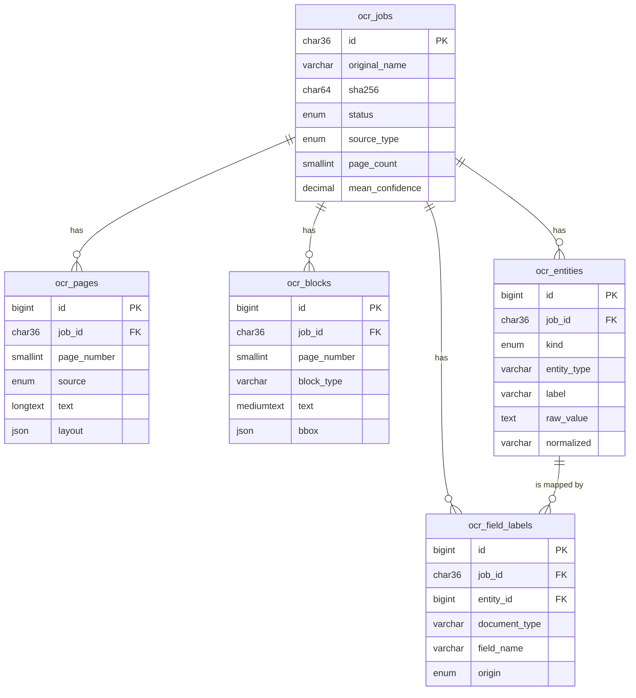

# Database

Five InnoDB tables, `utf8mb4_unicode_ci` throughout. The canonical definition is
[`db/schema.sql`](../db/schema.sql) — this page explains what the columns mean
and how to query them. The schema is written to be re-runnable, and
`src/Migrator.php` applies it automatically when `app.auto_migrate` is on.

## Overview



Every child table cascades on delete, so removing a job removes everything
derived from it. `ocr_field_labels.entity_id` is `ON DELETE SET NULL`: a label
survives if the entity it came from is re-extracted.

## Redundancy, on purpose

Page layout is stored twice: once as a JSON blob in `ocr_pages.layout`, and once
decomposed into `ocr_blocks` and `ocr_entities`.

The blob is the source of truth for rebuilding the document — one read per page,
no joins, no reassembly. The decomposed rows exist so you can ask questions
*across* documents ("every value ever labelled `Expediente`", "all table blocks
with low confidence") without unpacking JSON in every query. If they ever
disagree, the blob wins; re-ingesting a page rewrites both.

---

## `ocr_jobs`

One row per uploaded PDF. Written by `api/upload.php`, updated as pages arrive,
closed by `api/finalize.php`.

| Column | Type | Null | Default | Meaning |
| --- | --- | --- | --- | --- |
| `id` | `CHAR(36)` | no | — | UUID v4, generated in PHP. Primary key, and the JSON file name. |
| `original_name` | `VARCHAR(255)` | no | — | File name as uploaded, sanitised (path stripped, control characters removed). |
| `stored_name` | `VARCHAR(255)` | no | — | Name on disk in `storage/uploads`: `YYYYmmdd-His-<random>.pdf`. Never derived from user input. |
| `mime_type` | `VARCHAR(100)` | no | `application/pdf` | Detected with `finfo`, not taken from the browser. |
| `size_bytes` | `INT UNSIGNED` | no | `0` | Size of the uploaded file. |
| `sha256` | `CHAR(64)` | no | — | Hash of the file. Indexed, so you can spot a re-upload of the same document. |
| `language` | `VARCHAR(20)` | no | `spa` | Tesseract language code used for OCR pages. |
| `status` | `ENUM` | no | `pending` | `pending` → `processing` → `completed`, or `failed`. |
| `source_type` | `ENUM` | no | `unknown` | How the document was read overall: `text_layer`, `ocr`, `mixed`. |
| `page_count` | `SMALLINT UNSIGNED` | no | `0` | Pages in the PDF, known once the browser has opened it. |
| `pages_done` | `SMALLINT UNSIGNED` | no | `0` | Pages stored so far. Compare with `page_count` for progress. |
| `word_count` | `INT UNSIGNED` | no | `0` | Sum over pages, recomputed on every page insert. |
| `mean_confidence` | `DECIMAL(5,2)` | yes | `NULL` | Mean OCR confidence, 0–100. `NULL` when nothing was guessed. |
| `duration_ms` | `INT UNSIGNED` | yes | `NULL` | Wall-clock time of the run, measured in the browser. |
| `engine` | `JSON` | yes | `NULL` | What produced the result: `{ ocr, pdf, server, pipeline }`. |
| `result_path` | `VARCHAR(255)` | yes | `NULL` | Project-relative path of the written JSON. |
| `error_message` | `TEXT` | yes | `NULL` | Why the job failed, truncated to 2000 characters. |
| `created_at` / `updated_at` / `completed_at` | `DATETIME` | — | — | `completed_at` is `NULL` until the job finishes. |

Indexes: `created_at` (the recent list), `status`, `sha256`.

## `ocr_pages`

One row per page. `UNIQUE (job_id, page_number)` — re-ingesting a page deletes
and replaces it, so a retry can never duplicate.

| Column | Type | Null | Meaning |
| --- | --- | --- | --- |
| `job_id` | `CHAR(36)` | no | Owning job. |
| `page_number` | `SMALLINT UNSIGNED` | no | 1-based. |
| `width` / `height` | `DECIMAL(10,2)` | no | Page size in PDF points, after rotation. |
| `rotation` | `SMALLINT` | no | Rotation declared by the PDF, in degrees. |
| `source` | `ENUM` | no | `text_layer`, `ocr` or `empty`. |
| `confidence` | `DECIMAL(5,2)` | yes | Mean word confidence. `NULL` for `text_layer`. |
| `word_count` | `INT UNSIGNED` | no | Words kept after trimming empties. |
| `text` | `LONGTEXT` | yes | Reading-order text, blocks separated by a blank line. |
| `layout` | `JSON` | yes | `{ blocks, tables, key_values }` — the full structure, including word boxes. |

`layout` always keeps word-level detail. The `include_words` flag only decides
whether `DocumentAssembler` copies it into the exported JSON.

## `ocr_blocks`

One row per block, flattened out of `layout` for cross-document queries.
`UNIQUE (job_id, page_number, block_index)`.

| Column | Type | Meaning |
| --- | --- | --- |
| `block_index` | `SMALLINT UNSIGNED` | 0-based position in reading order; block `id` in the JSON is `p<page>-b<index+1>`. |
| `block_type` | `VARCHAR(32)` | `heading`, `paragraph`, `list`, `key_value` or `table`. Indexed. |
| `text` | `MEDIUMTEXT` | Block text, lines joined with `\n`. |
| `line_count` | `SMALLINT UNSIGNED` | Lines in the block. |
| `confidence` | `DECIMAL(5,2)` | Mean line confidence, `NULL` for text-layer pages. |
| `bbox` | `JSON` | `{ x0, y0, x1, y1 }` in PDF points, top-left origin. |

## `ocr_entities`

Both kinds of extraction land here, told apart by `kind`.

| Column | Type | Meaning |
| --- | --- | --- |
| `kind` | `ENUM` | `key_value` for `Label: value` candidates, `entity` for typed values. |
| `entity_type` | `VARCHAR(40)` | `key_value`, or one of `date`, `amount`, `percentage`, `email`, `url`, `phone`, `nif`, `nie`, `cif`, `iban`. Indexed. |
| `label` | `VARCHAR(255)` | The printed label, `key_value` rows only. Indexed — this is what field learning will group on. |
| `raw_value` | `TEXT` | Exactly as printed. |
| `normalized` | `VARCHAR(255)` | Machine form: the slug for a key/value (`fecha`), the ISO date, the numeric amount, the compacted IBAN. |
| `confidence` | `DECIMAL(5,2)` | Line confidence for `key_value` rows; `NULL` for entities. |
| `bbox` | `JSON` | Position, `key_value` rows only — entities come from a regex over page text, which has no box of its own. |

Rows are page-scoped and deduplicated per page by type and raw value; the same
IBAN on two pages gives two rows.

## `ocr_field_labels`

Created empty and deliberately unused. This is where the field-mapping milestone
will record that, in an invoice, the candidate labelled `Nº factura` is the
business field `invoice_number`.

| Column | Type | Meaning |
| --- | --- | --- |
| `entity_id` | `BIGINT UNSIGNED` | The candidate this label came from. `SET NULL` if that row is replaced. |
| `document_type` | `VARCHAR(64)` | Classified type: `invoice`, `acta`, `certificado`… |
| `field_name` | `VARCHAR(64)` | Business field the value maps to. |
| `field_value` | `TEXT` | Confirmed value, which may differ from what was extracted. |
| `origin` | `ENUM` | `manual` (a person confirmed it), `rule` (a heuristic), `model` (a prediction). |

Indexed on `(document_type, field_name)` for "show me every value ever confirmed
for this field".

---

## Queries worth keeping

Progress of anything still running:

```sql
SELECT original_name, pages_done, page_count, updated_at
FROM ocr_jobs
WHERE status = 'processing'
ORDER BY updated_at DESC;
```

Jobs abandoned by a closed tab — the cleanup nobody has written yet:

```sql
SELECT id, original_name, updated_at
FROM ocr_jobs
WHERE status = 'processing'
  AND updated_at < NOW() - INTERVAL 1 HOUR;
```

Which labels actually occur, across every document — the starting point for
field learning:

```sql
SELECT label, COUNT(*) AS seen, COUNT(DISTINCT job_id) AS documents
FROM ocr_entities
WHERE kind = 'key_value'
GROUP BY label
HAVING seen > 1
ORDER BY seen DESC;
```

Every IBAN found, newest document first:

```sql
SELECT j.original_name, e.page_number, e.normalized
FROM ocr_entities e
JOIN ocr_jobs j ON j.id = e.job_id
WHERE e.entity_type = 'iban'
ORDER BY j.created_at DESC;
```

Pages that deserve a second look:

```sql
SELECT j.original_name, p.page_number, p.source, p.confidence, p.word_count
FROM ocr_pages p
JOIN ocr_jobs j ON j.id = p.job_id
WHERE p.source = 'ocr' AND (p.confidence < 75 OR p.word_count = 0)
ORDER BY p.confidence;
```

Reach into the layout blob without rebuilding the document — every detected
table, as JSON:

```sql
SELECT job_id, page_number,
       JSON_EXTRACT(layout, '$.tables[*].rows') AS rows_json
FROM ocr_pages
WHERE JSON_LENGTH(layout, '$.tables') > 0;
```

Where the disk is going:

```sql
SELECT COUNT(*) AS jobs,
       ROUND(SUM(size_bytes) / 1048576, 1) AS pdf_mb,
       SUM(page_count) AS pages,
       SUM(word_count) AS words
FROM ocr_jobs;
```

## Housekeeping

Deleting a job through `api/jobs.php?job=<id>` also removes its PDF and its JSON
file. Deleting straight from SQL cascades the rows but leaves the files behind:

```sql
DELETE FROM ocr_jobs WHERE created_at < NOW() - INTERVAL 90 DAY;
```

Full reset — drop the database, delete the migration stamp, reload the page:

```sql
DROP DATABASE pdfocr;
```

```bash
rm storage/schema.applied
rm -f storage/uploads/* storage/output/*
```

## Changing the schema

1. Edit `db/schema.sql`. Keep it re-runnable: `CREATE TABLE IF NOT EXISTS`, and
   guard anything else.
2. Reload any page. `Migrator` notices the file's mtime changed and reapplies it.
3. If the change alters the exported JSON, bump `app.schema_version` in
   `config/config.php`.

`Migrator` has no down migrations and no version history — it is a bootstrapper
for a local tool, not a migration framework. For a destructive change on data
you care about, write the `ALTER` yourself and run it once.
